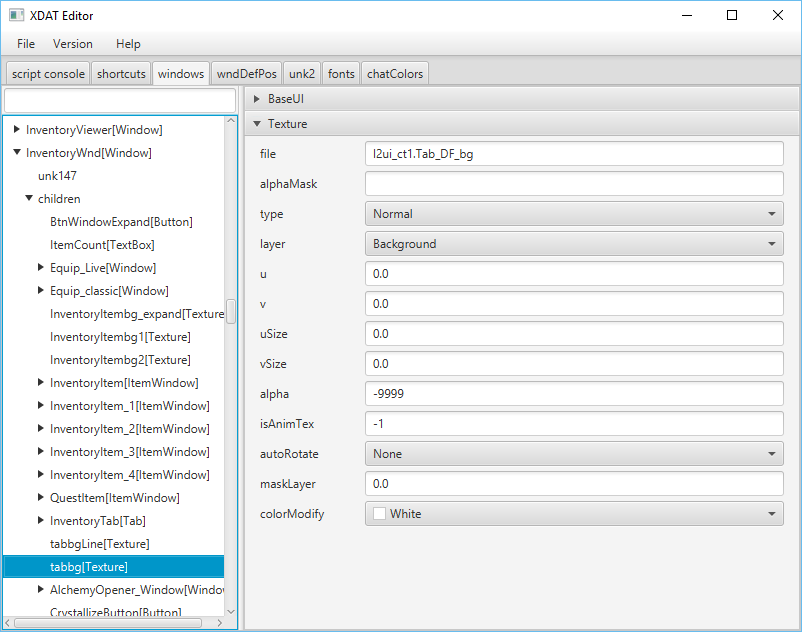

XdatEditor
==========

An open source interface.xdat editor.



Clone & Build
-------------
```
git clone https://github.com/acmi/xdat_editor.git
cd xdat_editor
git submodule init
git submodule update
gradlew build -x test
```

Run
---
`gradlew run`

Requirements
------------

Java 8u40 or later is required.